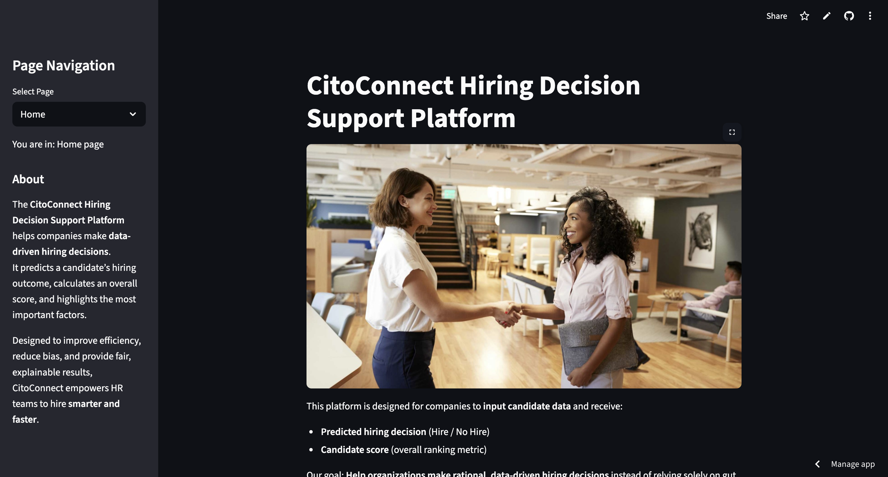
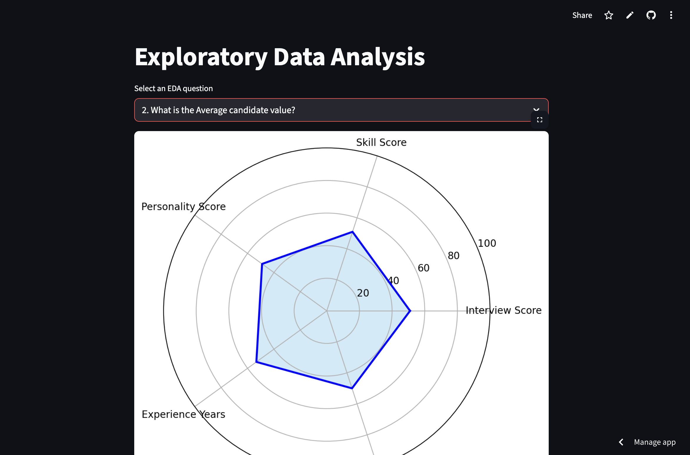
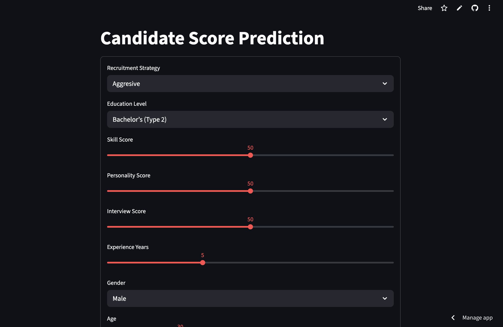

---

# Hiring Decision Support Platform

## Repository Outline

```
ModelDeploymentGhozy/
│
├── app.py                    - Main Streamlit application 
├── home.py                   - Homepage layout and content
├── eda.py                    - Exploratory Data Analysis 
├── predict.py                - Prediction logic script
├── best_xgb_model.pkl        - Trained XGBoost model
├── best_xgb_params.json      - Optimal model parameters 
├── recruitment_data.csv      - Training dataset
├── requirements.txt          - Python dependencies  
├── Training-the-HR-Team-1.20.20.jpg - Image used in homepage

assets/
│
├── Eda.png     - Screenshot of dashboards' EDA page
├── Home.png    - Screenshot of dashboards' Home page
├── Predict.png - Screenshot of dashboards' Predict page

1. README.md                  - Task overview 
2. inference_candidates.csv   - Randomly generated inference dataset  
3. P1M2_Ghozy_Reuski_inf.ipynb - Jupyter notebook for model inference  
4. P1M2_Ghozy_Reuski.ipynb     - Jupyter notebook containing full project workflow  
5. recruitment_data.csv       - Main recruitment dataset used for model training
6. URL.txt                    - Text file containing links to dataset and dashboard
```

## Problem Background

Hiring decisions are often made subjectively through interviews, test scores, and personal impressions.
However, without data-driven support, companies risk bias, inefficiency, and overlooking potential talent.
CitoConnect aims to provide **an ML-powered platform** that predicts hiring outcomes and ranks candidates based on multiple performance metrics, helping companies make **fair, consistent, and informed** hiring decisions.

## Project Output

* **Deployed Streamlit dashboard** for candidate input and prediction.
* **Predictive ML model** (XGBoost) for hiring classification.
* **Candidate scoring system** combining technical and soft-skill metrics.
* **Feature importance analysis** for explainability.

## Data

* **Source:** Synthetic dataset inspired by hiring decision research ([reference](https://arxiv.org/abs/2003.11591))
* **Shape:** \~1,000+ rows, 11 features
* **Features:** Age, Gender, EducationLevel, ExperienceYears, PreviousCompanies, DistanceFromCompany, InterviewScore, SkillScore, PersonalityScore, RecruitmentStrategy.
* **Target:** Hiring decision 
* **Missing Values:** None

## Method

* **Approach:** Supervised learning, classification task
* **Model:** XGBoost Classifier
* **Steps:**

  1. Data cleaning & preprocessing
  2. Feature encoding & scaling
  3. Model training & evaluation
  4. SHAP analysis for feature importance
  5. Candidate score calculation
  6. Model inference
  7. Deployment in Streamlit

## **Stacks**

* **Language:** Python 3.x
* **Framework:** Streamlit
* **Libraries:** pandas, numpy, scikit-learn, xgboost, shap, matplotlib, seaborn, scipy, joblib, json
* **Deployment:** Local / Streamlit Cloud

| **Library / Package** | **Main Function**                                                                                                                                                                                                                                                                                                                                                                                                                                                                 |
| --------------------- | --------------------------------------------------------------------------------------------------------------------------------------------------------------------------------------------------------------------------------------------------------------------------------------------------------------------------------------------------------------------------------------------------------------------------------------------------------------------------------- |
| **pandas**            | Data manipulation and analysis for tabular datasets.                                                                                                                                                                                                                                                                                                                                                                                                                              |
| **numpy**             | Numerical computations and array manipulation.                                                                                                                                                                                                                                                                                                                                                                                                                                    |
| **matplotlib**        | Data visualization using charts and plots.                                                                                                                                                                                                                                                                                                                                                                                                                                        |
| **seaborn**           | Statistical data visualization with enhanced aesthetics.                                                                                                                                                                                                                                                                                                                                                                                                                          |
| **scipy.stats**       | Statistical tests (Chi-Square, Kendall’s Tau, T-Test).                                                                                                                                                                                                                                                                                                                                                                                                                            |
| **scikit-learn**      | Preprocessing (`SimpleImputer`, `StandardScaler`), column transformation (`ColumnTransformer`), pipelines (`Pipeline`), data splitting (`train_test_split`, `StratifiedKFold`), parameter tuning (`GridSearchCV`, `RandomizedSearchCV`), ML algorithms (`LogisticRegression`, `SVC`, `KNeighborsClassifier`, `DecisionTreeClassifier`, `RandomForestClassifier`), model evaluation (`f1_score`, `roc_auc_score`, `classification_report`, `confusion_matrix`, `RocCurveDisplay`). |
| **xgboost**           | Gradient boosting algorithm for classification (`XGBClassifier`).                                                                                                                                                                                                                                                                                                                                                                                                                 |
| **shap**              | Model interpretation using SHAP values.                                                                                                                                                                                                                                                                                                                                                                                                                                           |
| **joblib**            | Saving and loading Python models/objects.                                                                                                                                                                                                                                                                                                                                                                                                                                         |
| **json**              | Reading and writing JSON files.                                                                                                                                                                                                                                                                                                                                                                                                                                                   |
| **streamlit**         | Building interactive dashboards and web applications.                                                                                                                                                                                                         
| **warnings**          | Managing warnings to keep outputs clean.       |                                                                  
---

## Screenshots

Below is the main dashboard of the **CitoConnect Hiring Decision Support Platform**:


On this page, users can:

- Read a brief introduction to the platform and its purpose.

- Understand how the tool supports data-driven hiring decisions.

- View the About section, which explains the platform’s goals and benefits.

- Navigate to other sections such as EDA and Prediction via the sidebar menu.

---

Below is the EDA page of the **CitoConnect Hiring Decision Support Platform**:


On this page, users can:

- Explore visual data analysis of the recruitment dataset.

- See distributions of candidate attributes such as education level, experience, and interview scores.

- Identify patterns, correlations, and potential biases in the hiring dataset.

- Gain insights to support feature importance understanding before prediction.
---

Below is the Prediction page of the **CitoConnect Hiring Decision Support Platform**:


On this page, users can:

- Input candidate details (education, experience, skill scores, etc.).

- Get an instant prediction on whether the candidate is recommended for hiring.

- View the CandidateScore, which combines model probability and weighted heuristic scoring.

- See a radar-chart visualization of CandidateScore.

# URL

The dashboard can be visited here:
[CitoConnect Hiring Decision Support Platform](https://citoconnect.streamlit.app/)

## References

* Research paper: [Hiring Decision Support System](https://arxiv.org/abs/2003.11591), [Multi-Task Dynamic Weight Optimization](https://www.mdpi.com/2076-3417/15/5/2473), [Bias Monitoring](https://arxiv.org/abs/2309.13933), [Data-driven HR](https://arxiv.org/abs/1606.05611)
* GitHub Markdown Guide: [Basic Writing and Formatting Syntax](https://docs.github.com/en/get-started/writing-on-github/getting-started-with-writing-and-formatting-on-github/basic-writing-and-formatting-syntax)

---

